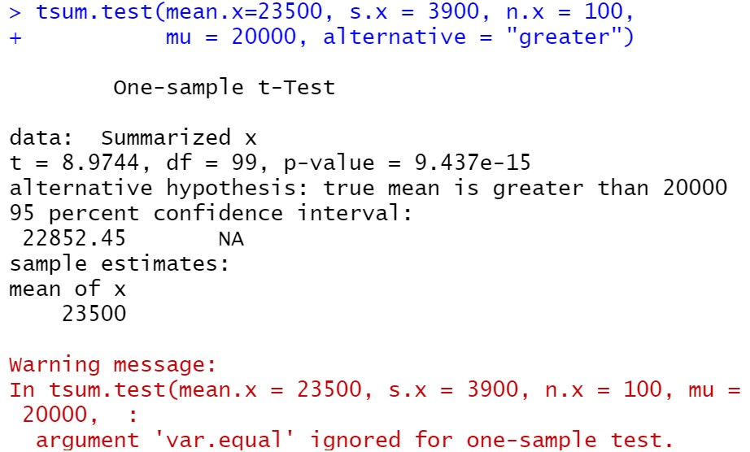

# Modul 2 Praktikum Probstat 2022

## No 1

## No 2

- a. Apakah Anda setuju dengan klaim tersebut?

   Setuju, karena jika diuji dengan t-test dapat dibuktikan bahwa H0 ($\mu > 20000$) benar.

- b. Jelaskan maksud dari output yang dihasilkan!

   Berdasarkan parameter dan statistik yang telah diketahui, didapatkan bahwa nilai $t_{hitung}$ adalah $8.9744$. Nilai $t_{tabel}$ untuk $v=99; \alpha=0.05$ untuk right-tail test adalah $1.660$. Dengan demikian, dapat disimpulkan bahwa klaim H1 ($\mu > 20000$) terbukti.

- c. Buatlah kesimpulan berdasarkan P-Value yang dihasilkan!

   $9.437\times 10^{-15} < \alpha$, maka $H_0$ ditolak ($H_1$ diterima). Dengan demikian, klaim yang diberikan pada soal ($\mu>20000$) terbukti.

## No 3

- a. H0 dan H1
  
  $H_0: \mu_1=\mu_2$

  $H_1: \mu_1\neq\mu_2$

- b. Hitung Sampel Statistik
  
  Pooled-Variance $t$

  $S_p^2=2.1705$

  $t=1.9267$

  Estimasi CI

  $-0.0391 \leq \mu_1-\mu_2 \leq 1.7391$

- c. Lakukan Uji Statistik (df=2)

  $t=1.9267$

- d. Nilai Kritikal
  
  Nilai kritikal $=\plusmn2.9200$
  Maka, nilai uji T terletak di luar daerah tolak $H_0$

- e. Keputusan

  Terima $H_0$ pada $\alpha=0.05$
  
- f. Kesimpulan
  
  Tidak ditemukan cukup bukti bahwa ditemukan
  perbedaan pada nilai mean

## No 4

## No 5
