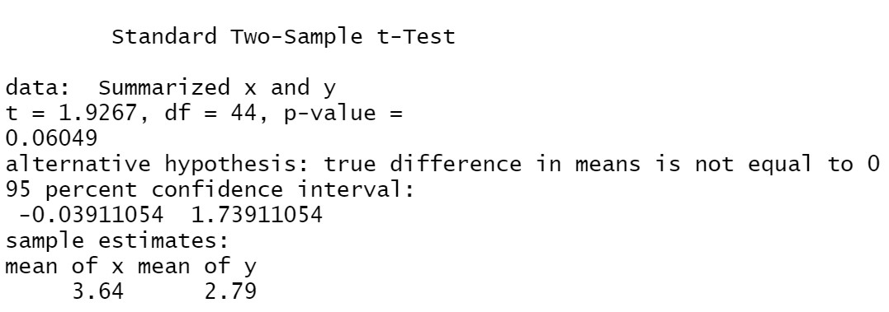

# Modul 2 Praktikum Probstat 2022

## No 1

## No 2

- a. Apakah Anda setuju dengan klaim tersebut?

   Setuju, karena jika diuji dengan t-test dapat dibuktikan bahwa H0 ($\mu > 20000$) benar.

- b. Jelaskan maksud dari output yang dihasilkan!

   Berdasarkan parameter dan statistik yang telah diketahui, didapatkan bahwa nilai $t_{hitung}$ adalah $8.9744$. Nilai $t_{tabel}$ untuk $v=99; \alpha=0.05$ untuk right-tail test adalah $1.660$. Dengan demikian, dapat disimpulkan bahwa klaim H1 ($\mu > 20000$) terbukti.

- c. Buatlah kesimpulan berdasarkan P-Value yang dihasilkan!

   $9.437\times 10^{-15} < \alpha$, maka $H_0$ ditolak ($H_1$ diterima). Dengan demikian, klaim yang diberikan pada soal ($\mu>20000$) terbukti.

## No 3

- a. H0 dan H1
  
  $H_0: \mu_1=\mu_2$

  $H_1: \mu_1\neq\mu_2$

- b. Hitung Sampel Statistik
  
  

  Pooled-Variance $t$

  $S_p^2=2.1705$

  

  $t=1.9267$

  Estimasi CI

  $-0.0391 \leq \mu_1-\mu_2 \leq 1.7391$

- c. Lakukan Uji Statistik (df=2)

  $t=1.9267$

- d. Nilai Kritikal
  
  Nilai kritikal $=\plusmn 2.9200$
  Maka, nilai uji T terletak di luar daerah tolak $H_0$

- e. Keputusan

  Terima $H_0$ pada $\alpha=0.05$
  
- f. Kesimpulan
  
  Tidak ditemukan cukup bukti bahwa ditemukan
  perbedaan pada nilai mean

## No 4

- a. Buatlah masing masing jenis spesies menjadi 3 subjek "Grup" (grup 1,grup
2,grup 3).Lalu Gambarkan plot kuantil normal untuk setiap kelompok dan
lihat apakah ada outlier utama dalam homogenitas varians.

- b. carilah atau periksalah Homogeneity of variances nya , Berapa nilai p yang
didapatkan? , Apa hipotesis dan kesimpulan yang dapat diambil ?

- c. Untuk uji ANOVA (satu arah), buatlah model linier dengan Panjang versus
Grup dan beri nama model tersebut model 1.

- d. Dari Hasil Poin C, Berapakah nilai-p ? , Apa yang dapat Anda simpulkan
dari H0?

- e. Verifikasilah jawaban model 1 dengan Post-hoc test Tukey HSD, dari nilai p
yang didapatkan apakah satu jenis kucing lebih panjang dari yang lain?
3
Jelaskan.

- f. Visualisasikan data dengan ggplot2

## No 5
